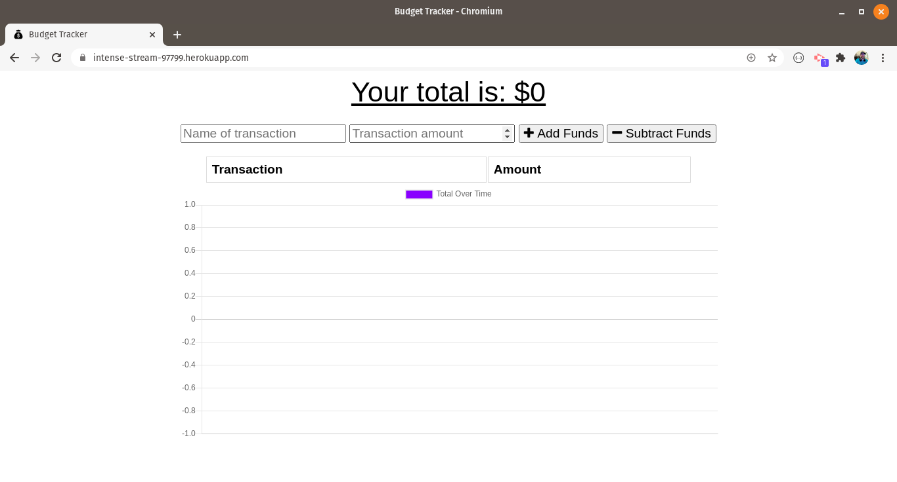

# PWA-Budget-Tracker

## Description

PWA-Budget-Tracker is a progressive web application designed to allow an individual to track expenses regardless of network connectivity. The web application has the ability to add or remove an expense while presenting it with an easy to read graph.

Since the application is a PWA, you can continue to use the service even without web connectivity. Once connection is re-established, your data will sync to the main database to provide uninterrupted service.

- Add or subtract expenses
- Display a trend graph of expenses
- Offline functionality will allow you to add or subtract expenses
- Offline expenses will sync back up when connection is re-established
- Manifest allows for downloading of PWA

## Table of Contents

- [Installation](#installation)
- [Usage](#usage)
- [Credits](#Credits)
- [Questions](#questions)

## Installation

1. Prerequisite: MongoDB is already installed and configured
2. Clone the repository then run `npm install package.json` to make sure all dependencies are gotten.
3. Navigate to the DB folder.
4. Start the server by running `node server.js` or by using `nodemon`

## Usage

Once the server is running, you can connect to localhost:3001 or the deployed application. All data is sent through the front end with the add/remove options using RESTful API routes.

## Credits

http://github.com/mondrovic

## Inquiries

Any questions or inquiries can go to mondrovic1@gmail.com
Matthew Ondrovic
https://githbub.com/mondrovic
